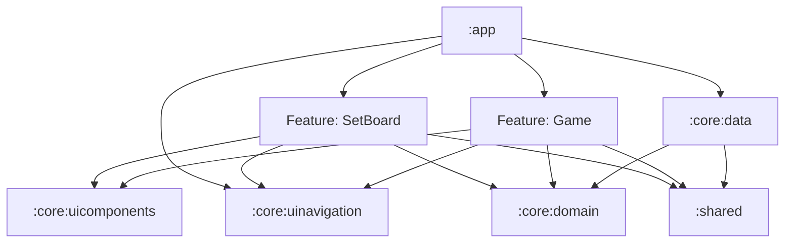

# ♛ N-Queens – Android Application

An Android puzzle game based on the classic **N-Queens problem**, built entirely in **Kotlin** with a strong focus on clean architecture, testability, and extensibility.

The goal of the game is to place **N queens on an N×N chessboard** so that no two queens threaten each other (no shared row, column, or diagonal).

This project was designed not only as a technical solution to the challenge, but also as a **solid base for future extensions**, such as competitive play and rankings.

---

## 📱 Features

### ♟️ Gameplay
- Selectable board size (**N ≥ 4**, since smaller boards have no solutions)
- Fully interactive **dynamic N×N chessboard**
- Tap to place or remove queens
- **Real-time conflict detection** with visual feedback
- Counter showing **queens left to place**
- Reset / restart game at any moment
- Victory detection when the puzzle is correctly solved

### 🏆 Victory & Competition
- Instead of navigating to a separate victory screen, the success state is shown using a **Victory Dialog**
- This design choice keeps the focus on the **two core screens** of the app, which already contain all required functionality
- The app is structured to support **multiple players competing visually**, storing and displaying **best times per board size (N)** in a ranking

### 🎨 UI & UX
- Responsive and scalable chessboard layout
- Clear queen representation (icon-based)
- Conflicting queens are clearly highlighted
- Simple, clean, and extensible UI built with **Jetpack Compose**
- Animations and visual feedback where appropriate

---


## ▶️ Build & Run

1. Clone the repository
2. Open the project in **Android Studio**
3. Sync Gradle
4. Run the app on an emulator or physical device

---

## 🧠 Architecture

This project follows **Clean Architecture principles** with a deliberately lean implementation, optimized for clarity and extensibility.

### ✅ Clean Architecture Rules Applied

**1) Dependency Rule (inward only)**  
Source code dependencies point **inwards**: UI depends on Domain abstractions; Data depends on Domain contracts/models; Domain does **not** depend on UI/Data.

**2) Separation of concerns**  
- **UI layer**: rendering + user interaction (Compose screens/components)
- **Presentation layer**: state management + orchestration (ViewModels)
- **Domain layer**: business rules (game validation, timers, use cases)
- **Data layer**: persistence and implementations (Room, repositories)

**3) Testability by design**  
Most logic lives in **Domain** (pure Kotlin), allowing fast and reliable unit tests. UI tests validate end-to-end flows.

---

## 🧩 Modules & Responsibilities

- **`:app`**
  - Application entry point (Android app module)
  - App navigation host / wiring
  - DI setup and composition of feature + core modules

- **Feature modules** (presentation + UI)
  - Example: `:feature:setboard`, `:feature:game` (or equivalent)
  - Compose screens, dialogs, UI components
  - ViewModels
  - Maps UI models ↔ domain models through dedicated mappers

- **Core modules**
  - **`:core:domain`**
    - Entities and business rules (N-Queens logic)
    - Use cases (e.g., place queen, observe scores, save results)
    - Repository contracts (interfaces)
  - **`:core:data`**
    - Repository implementations
    - Room DB + DAOs + data sources
    - Mapping between DB models and domain models

- **Reusable UI libraries (project-agnostic)**
  - **`:core:uicomponents`**
    - A reusable UI toolkit of **generic Compose components** (cards, panels, small widgets, typography helpers, etc.)
    - Designed to be **drop-in** across different apps/projects
    - Contains *visual building blocks*, not N-Queens business rules
  - **`:core:uinavigation`**
    - A reusable navigation helper library
    - Provides an opinionated way to define **navigation flows** (graph/flow definitions, destinations, and helpers)
    - Keeps navigation concerns consistent and decoupled from features

- **Shared utilities**
  - **`:shared` / `:core:shared`**
    - Shared models (UI-facing), mappers, and cross-feature utilities

---

## 🔗 Module Dependency Diagram

The following diagram shows how modules connect while respecting the **Clean Architecture dependency rule** (dependencies always point inward):



### Reading the diagram
- **Features never depend on Data** directly. They talk to **Domain** via use cases.
- **Data implements Domain contracts** (repositories) and is wired into the app through DI.
- **`:core:uicomponents`** is a **reusable UI library**: features consume it, but it contains no domain rules.
- **`:core:uinavigation`** provides **flow-based navigation helpers** to keep routing consistent and decoupled.
- **Domain stays framework-agnostic** (pure Kotlin), making it easy to test and evolve.

### Reading the diagram
- **Features never depend on Data** directly. They talk to **Domain** via use cases.
- **Data implements Domain contracts** (repositories) and is wired into the app through DI.
- **Domain stays framework-agnostic** (pure Kotlin), making it easy to test and evolve.

---

## 🧪 Testing Strategy

Testing is treated as a first-class citizen in this project and is approached from **two complementary angles**:

### 1️⃣ Unit Tests
Focused on validating business logic, game rules, and ViewModel behavior.

Run with:
```bash
./gradlew :app:testDebugUnitTest --stacktrace
```

### 2️⃣ Integration / UI Tests
End-to-end tests validating user flows and UI interactions using Android instrumentation tests.

Run with:
```bash
./gradlew :app:connectedDebugAndroidTest --stacktrace
```

### 📊 Code Coverage – Kover

The project uses **Kover** to generate coverage reports:

```bash
./gradlew koverXmlReport koverHtmlReport --stacktrace
```

- Both **XML and HTML reports** are generated
- The HTML report is **not currently uploaded to an external analysis platform** (e.g. SonarQube)
- This was a conscious choice for simplicity, but the setup is fully compatible with such tools and can be easily extended

---

## 🤖 Continuous Integration

A complete CI pipeline is defined in:

```
.github/workflows/android-ci.yml
```

### The pipeline includes:
- Running **unit tests**
- Running **instrumentation tests**
- Generating **Kover coverage reports**
- Executing **ktlint** for code style enforcement
- Assembling a **debug build**

The workflow is triggered automatically on **pull requests to `develop` or `main`**, ensuring code quality and stability before merging.

---

## 📦 Key Technologies & Dependencies

- **Kotlin**
- **Jetpack Compose** – UI
- **Android ViewModel & StateFlow** – State management
- **Hilt** – Dependency Injection
- **Room** – Persistence of game results
- **Coroutines & Flow** – Async and reactive state
- **MockK** – Unit testing
- **Espresso / Compose UI Testing** – Integration tests
- **Kover** – Code coverage
- **ktlint** – Code style
- **GitHub Actions** – CI/CD

---

Thank you for reviewing this submission ♛
